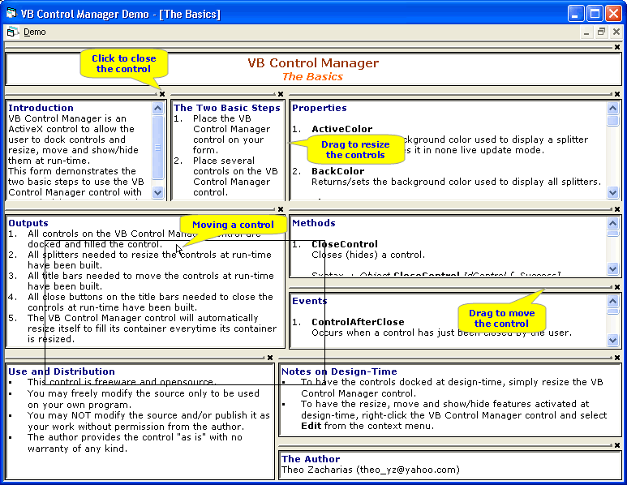



## VB Control Manager

### Description

VB Control Manager is an ActiveX control to allow the user to dock controls and resize, move and show/hide them at run-time. This is actually the improvement of my VB Splitter, an ActiveX control to resize docked controls at run-time. I change the name because VB Control Manager can do a lot of more than just to split/resize control.

VB Control Manager has 14 properties, 4 methods, and 18 events customly made, plus two collection: a Controls collection (with 20 properties) and a Splitters collection (with 27 properties).

To use the control, just place the VB Control Manager control on your form and add several controls on it. That's it! You don't have to add any codes to your form to have basic features of VB Control Manager. Just don't miss the demo (open the VB Control Manager Demo.vbg). Your feedback and votes will be very appreciated.
 
### More Info
 
This ActiveX control uses subclassing, so DO NOT stop the debugger with the IDE STOP BUTTON or else VB may crash

             |
---                |---
**Submitted On**   |2003-11-13 14:41:06
**By**             |[Theo Z](https://github.com/Planet-Source-Code/PSCIndex/blob/master/ByAuthor/theo-z.md)
**Level**          |Advanced
**User Rating**    |5.0 (189 globes from 38 users)
**Compatibility**  |VB 6\.0
**Category**       |[Custom Controls/ Forms/  Menus](https://github.com/Planet-Source-Code/PSCIndex/blob/master/ByCategory/custom-controls-forms-menus__1-4.md)
**World**          |[Visual Basic](https://github.com/Planet-Source-Code/PSCIndex/blob/master/ByWorld/visual-basic.md)
**Archive File**   |[VB\_Control16716711132003\.zip](https://github.com/Planet-Source-Code/theo-z-vb-control-manager__1-49621/archive/master.zip)

